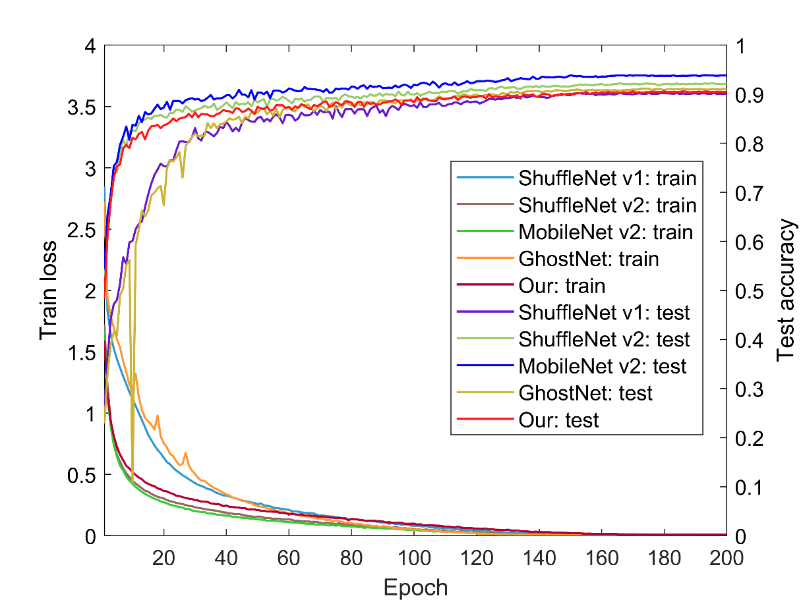

# A Lightest CNN Network Architecture

I'm playing with [PyTorch](http://pytorch.org/) on the CIFAR10 dataset.

## Prerequisites
- Python 3.6+
- PyTorch 1.0+
- thop
- tensorboardX

## Training
```
# Start training with: 
python train.py

# Start testing with: 
python test.py
```

## Experimental setting：
```
Epoch = 200  
Batchsize = 128  
Learning rate = 0.1  
momentum = 0.9  
weight_decay = 4e-5
```

## Loss and error curves：




## Accuracy
| Model          |       | Params(M) | FLOPs(M)  | Acc(%) |
| -------------- | ---   | -------   | ----      | ----   |
| ShuffleNet V1  | G=2   |  2.05     | 90.34     | 90.28  |
| ShuffleNet V2  | 1.0x  |  1.26     | 46.13     | 92.25  |
| MobileNet V1   | 1.0x  |  3.22     | 178.06    | 93.15  |
| MobileNet V2   | 1.0x  |  2.30     | 94.60     | 93.90  |
| MobileNet V3   | Small |  1.68     | 18.49     | 91.64  |
| MobileNet V3   | Large |  4.21     | 68.67     | 94.03  |
| GhostNet       | R=3   |  3.63     | 35.20     | 91.13  |
| GatherNet      | 1.0x  |  0.24     | 21.01     | 90.60  |


